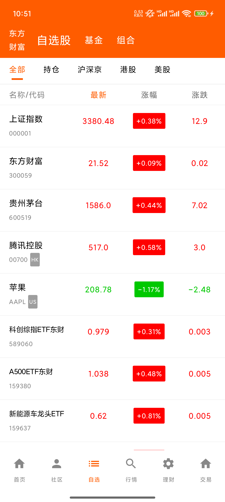

# StockApp 股票行情应用

一款基于Android平台的股票行情查看应用，使用Jetpack Compose构建现代化UI界面。

## 功能特点

- 自选股：查看和管理您关注的股票
- 股票分类：支持全部、持仓、沪深京、港股等多种分类查看
- 基金：查看基金行情和信息
- 组合：管理投资组合
- 实时数据：展示股票的最新价格、涨跌幅等关键指标
- 多维度排序：支持按最新价、涨幅、涨跌等多种方式排序

## 应用截图


## 技术栈

- Kotlin语言
- Jetpack Compose UI框架
- ViewModel + LiveData架构
- Hilt依赖注入
- Material Design设计规范

## 开发环境

- Android Studio Meerkat或更高版本
- Kotlin 2.1.10或更高版本
- Gradle 8.9.1或更高版本
- JDK 21

## 安装使用

1. 克隆代码库
   ```
   git clone https://github.com/shenguojun/StockApp.git
   ```

2. 使用Android Studio打开项目

3. 编译并运行到设备或模拟器上

## 项目结构

- `app/src/main/java/com/shengj/stockapp/`: 主代码目录
  - `model/`: 数据模型
  - `ui/`: 用户界面组件
    - `stocks/`: 股票相关界面
  - `MainActivity.kt`: 应用入口

## 许可证

```
MIT License

Copyright (c) 2025 申国骏

Permission is hereby granted, free of charge, to any person obtaining a copy
of this software and associated documentation files (the "Software"), to deal
in the Software without restriction, including without limitation the rights
to use, copy, modify, merge, publish, distribute, sublicense, and/or sell
copies of the Software, and to permit persons to whom the Software is
furnished to do so, subject to the following conditions:

The above copyright notice and this permission notice shall be included in all
copies or substantial portions of the Software.

THE SOFTWARE IS PROVIDED "AS IS", WITHOUT WARRANTY OF ANY KIND, EXPRESS OR
IMPLIED, INCLUDING BUT NOT LIMITED TO THE WARRANTIES OF MERCHANTABILITY,
FITNESS FOR A PARTICULAR PURPOSE AND NONINFRINGEMENT. IN NO EVENT SHALL THE
AUTHORS OR COPYRIGHT HOLDERS BE LIABLE FOR ANY CLAIM, DAMAGES OR OTHER
LIABILITY, WHETHER IN AN ACTION OF CONTRACT, TORT OR OTHERWISE, ARISING FROM,
OUT OF OR IN CONNECTION WITH THE SOFTWARE OR THE USE OR OTHER DEALINGS IN THE
SOFTWARE.
``` 